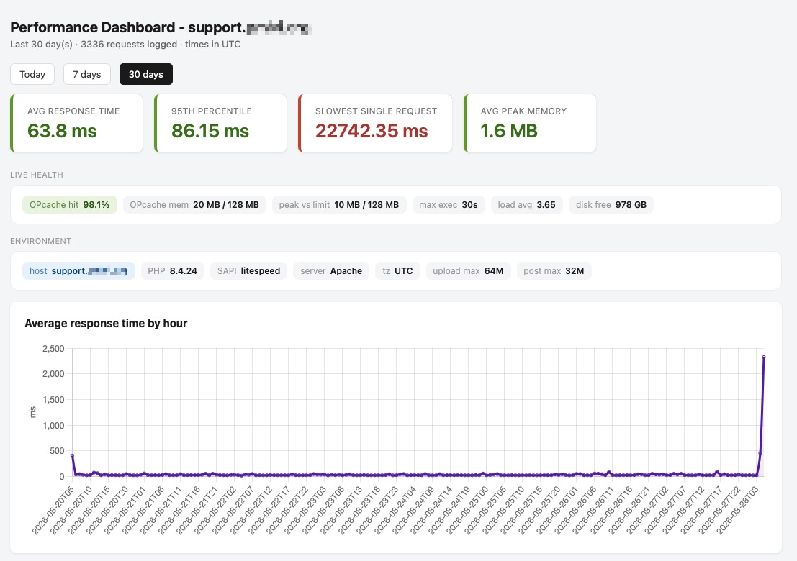
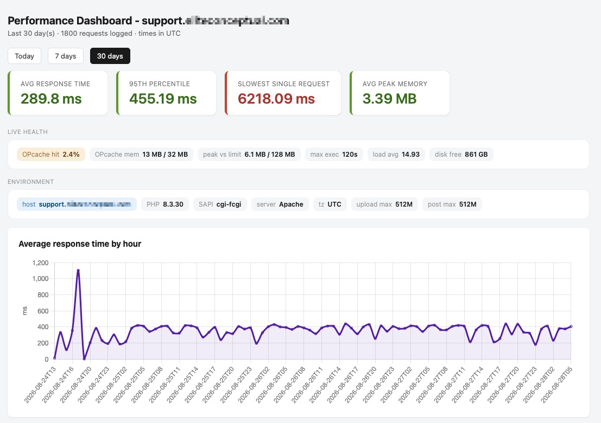
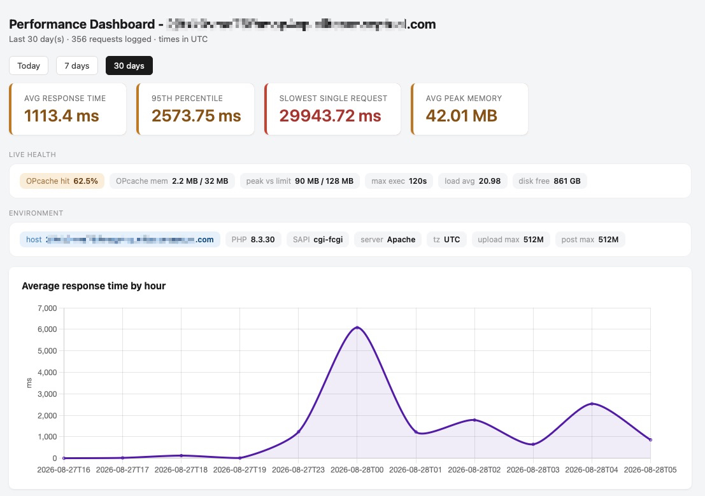

# Performance Monitor

A dependency-free PHP request-timing monitor. Logs every request (timing,
memory, OPcache hit rate, HTTP status) to daily JSON-lines files, and renders
an HTML dashboard with response-time trends, slowest endpoints, and live
server/PHP health. No database, no framework, no application code changes.

Built for WordPress/MainWP but works on any PHP site.

- **Zero dependencies** — plain PHP, no Composer, no database, no build step.
- **No code changes** — hooks in via `auto_prepend_file`; never touches app code.
- **Per-request logging** — timing, memory delta, peak memory, OPcache hit rate, HTTP status.
- **HTML dashboard** — response-time trend, slowest endpoints, color-coded summary cards, live server/PHP health chips.
- **Self-contained installer** — one script, prompts for paths, wires everything up.

**Requirements:** PHP 7.0+ (uses `register_shutdown_function`, `DateTime`). The
`.user.ini` method needs PHP-FPM or CGI; on mod_php, set `auto_prepend_file` in
`php.ini` or `.htaccess` instead.

## Screenshots

<a href="images/sample_1.jpg"></a>

<a href="images/sample_2.jpg"></a>

<a href="images/sample_3.jpg"></a>

## What's in the repo

```
install-perf-dashboard.sh   <- self-contained installer (embeds all 4 PHP files)
LICENSE
README.md
images/                     <- screenshots used in this README
perf-monitor/
  perf_start.php            <- logger, loaded via auto_prepend_file
  perf_end.php              <- no-op, kept only for hosts with a global auto_append_file
  perf-config.sample.php    <- config template — copy to perf-config.php and edit
perf-dashboard/
  dashboard.php             <- the viewer (password-protect this)
```

> **Source of truth:** `install-perf-dashboard.sh` embeds its own copies of all
> four PHP files — that embedded copy is what the installer actually deploys.
> The files under `perf-monitor/` and `perf-dashboard/` are the readable
> reference copies; if you edit them, re-sync the installer's heredocs to match.

## Install — the easy way (recommended)

The installer is self-contained: it embeds all four PHP files, so you only need
this one script on the server. It prompts for paths, writes the files, bakes
your config, generates `.user.ini`, optionally password-protects the dashboard,
and offers to delete itself when done.

```
bash install-perf-dashboard.sh
```

It asks for:

- **perf-monitor path** — where the logger + config live (above the web root)
- **log dir** — where `.jsonl` logs are written (above the web root)
- **dashboard path** — a web-accessible directory for the viewer
- **web root** — so it can drop `.user.ini` (leave blank to wire it yourself)
- **app subdir** — optional, for apps that route through a subdirectory
  (e.g. a WordPress install in a subfolder — a second `.user.ini` goes here)
- **timezone** — defaults to UTC

The installer rewrites the dashboard's `$configPath` to wherever the config
ended up, so the two directories don't need to be siblings.

## Install — the manual way

1. **Copy the folders.** Put `perf-monitor/` somewhere the site's PHP can read
   (above the web root). Put `perf-dashboard/` somewhere web-accessible.

2. **Create your config from the sample:**
   ```
   cp perf-monitor/perf-config.sample.php perf-monitor/perf-config.php
   ```
   Then edit `perf-config.php` — at minimum set `log_dir` to an absolute path
   ABOVE the web root. Review the other commented settings.

   > A fresh clone has only `perf-config.sample.php`. The logger and dashboard
   > include `perf-config.php`; until you create it, the dashboard shows a
   > "config not found" error and the logger stays silent (it fails safe).

3. **Point the dashboard at your config** (only if `perf-dashboard/` and
   `perf-monitor/` are NOT siblings). Edit `$configPath` near the top of
   `dashboard.php` to the absolute path of `perf-config.php`.

4. **Enable the logger** via `auto_prepend_file`, pointing at the absolute path
   of `perf_start.php`:

   - Your own `php.ini`:
     ```
     auto_prepend_file = /absolute/path/to/perf-monitor/perf_start.php
     ```
   - Or a `.user.ini` (PHP-FPM/CGI hosts) in the web root — and, for apps that
     route through a subdirectory (e.g. WordPress admin), a second copy in that
     subdirectory:
     ```
     auto_prepend_file = /absolute/path/to/perf-monitor/perf_start.php
     ```

   Do NOT rely on `auto_append_file` — PHP skips it on `exit()`/`die()`, which
   most apps (including WordPress admin) do. The logger uses a shutdown function
   instead, so only the prepend is needed.

   > `.user.ini` changes are cached; wait `user_ini.cache_ttl` seconds
   > (default 300) or restart PHP-FPM before testing.

5. **If a GLOBAL php.ini you can't edit already sets `auto_append_file`** to a
   `perf_end.php` path, keep `perf_end.php` where that path expects it — it's a
   harmless no-op. Otherwise you can delete `perf_end.php`.

6. **Password-protect `perf-dashboard/`.** It renders request paths (which can
   contain IDs). Add a `.htaccess` in that directory:
   ```
   AuthType Basic
   AuthName "Performance Dashboard"
   AuthUserFile /absolute/path/above/webroot/.htpasswd_perf
   Require valid-user
   ```
   Create the password file with:
   ```
   htpasswd -c /absolute/path/above/webroot/.htpasswd_perf youruser
   ```

7. **Verify.** Load a few pages, then check the log dir for
   `perf_YYYY-MM-DD.jsonl`, and open `dashboard.php`. Run
   `php -l perf_start.php` on the server to confirm syntax.

## Configuration

All settings live in `perf-config.php` (copied from `perf-config.sample.php`).
Key options, each documented inline in the file:

- `log_dir` — where logs are written/read (required).
- `timezone` — used by both logger and dashboard (default UTC).
- `min_samples` — min requests before an endpoint appears in the slowest table.
- `slow_threshold_ms` — endpoints slower than this are highlighted.
- `route_params` — query keys that identify distinct endpoints (default `page`, `action`).
- `card_*` thresholds — green/amber/red bands for the four summary cards.

## Notes

- Overhead is ~1 ms/request (visible in the dashboard's own row). Safe to leave
  running continuously.
- All timestamps use the configured `timezone` (default UTC) end to end. Mixing
  timezones between logger and dashboard drops rows logged near midnight, so
  both read the same value from config.
- The dashboard groups router endpoints by the query keys in `route_params`
  (default `page`, `action` for WordPress/MainWP) and strips all other query
  strings so per-request IDs group together.
- The health/environment chips reflect the server the dashboard runs on. Point a
  dashboard at logs copied from another host and the chips describe the
  dashboard's host, not the logged one.
- Logs grow unbounded — add a cron to prune old files if needed:
  ```
  find /path/to/perf_logs -name 'perf_*.jsonl' -mtime +30 -delete
  ```

## License

See [LICENSE](LICENSE).